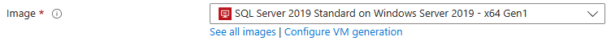
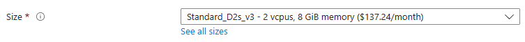
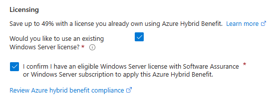
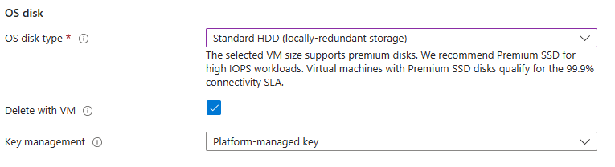
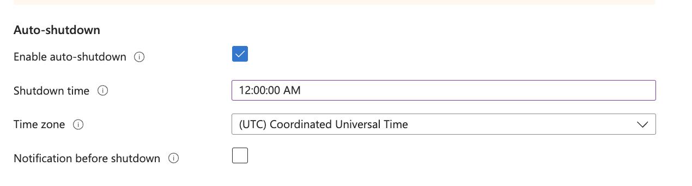
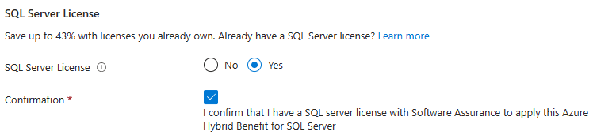
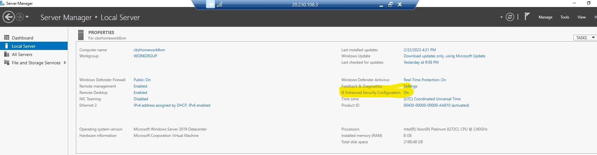
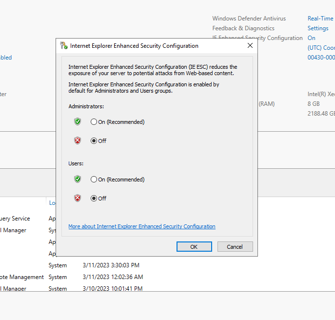

# Homework 5 - Working with Virtual Machines

This guide will walk you through the process of setting up a Windows Virtual Machine (VM) in the Azure cloud. This VM will serve as your environment for working with NoSQL databases using Cosmos and the NoSQL API. Please read through the entire guide before deployment to avoid any cost overruns. Incorrect steps may lead to charges beyond your Azure allowance.

## Prerequisites

Before you begin, make sure you have the following:

- An Azure account
- Access to the Azure portal

## Step 1: Create a Windows VM

Follow the Microsoft Learn tutorial "Quickstart - Create a Windows VM in the Azure portal" to create your VM. [Link to Tutorial](https://learn.microsoft.com/en-us/azure/virtual-machines/windows/quick-create-portal)

### Important Configuration Steps

In the tutorial, pay attention to the following custom settings to prevent cost overruns:

1. **Image Selection**: Choose the Windows image recommended in the tutorial.

    

2. **Virtual Machine Size**: Select "Standard_D2s_v3" for your virtual machine size.

    

3. **Licensing**: Choose the option stating that you have a license for trial purposes.

    

4. **Disks**: Select "Standard HDD" for disk type.

    

5. Navigate to the 'Management' tab and enable the 'Auto-Shutdown' feature.
     
   
7. Leave the default settings for Networking, Monitoring, and Advanced tabs.

8. On the "SQL Server Settings" tab, confirm that you have a license.

    

9. Review your selections and proceed with VM creation.

## Step 2: Connecting to the Virtual Machine

After successfully creating the VM, follow the tutorial's instructions for connecting to the virtual machine.

- adminUsername: "ds310admin"; adminPassword: "ds310password013!"

### Note:

- If you're on the BU network, use a VPN connection as port 3389 is blocked on the BU network.
- Alternatively, if you prefer using the BU network, refer to this YouTube video for guidance. Please remember that we'll be using port 3100 instead of the 5432 as demonstrated in the video: https://www.youtube.com/watch?v=5_24GbLbOK4
- Mac users should install the "Remote Desktop application from the Apple Store" for connecting. [Link](https://apps.apple.com/us/app/microsoft-remote-desktop/id1295203466?mt=12)

## Step 3: Important Post-Configuration Steps

After connecting to your VM, perform the following actions:

1. **Configure Auto-Shutdown**: Set a time for the VM to automatically shut down when not in use. You can adjust the time based on your preference.

2. **Use "Stop" to Shut Down**: Whenever you finish using the VM, use the "Stop" button to shut down the machine. If prompted to keep the IP address, do so.

3. **Disable IE Enhanced Security Configuration**: In the Virtual Machine's "Server Manager," turn off Internet Explorer Enhanced Security Configuration under "local server."

    

    

## Step 4: Install Power BI Desktop

Download and install Power BI Desktop (x64) on your VM using your BU email for a trial of the software. You can download it [here](https://powerbi.microsoft.com/en-us/desktop/).

## Additional Notes

- Always be mindful of your Azure resources to avoid unexpected charges.
- Save the VM configuration details and connection information for future reference.

**Happy working with your Azure VM!**
