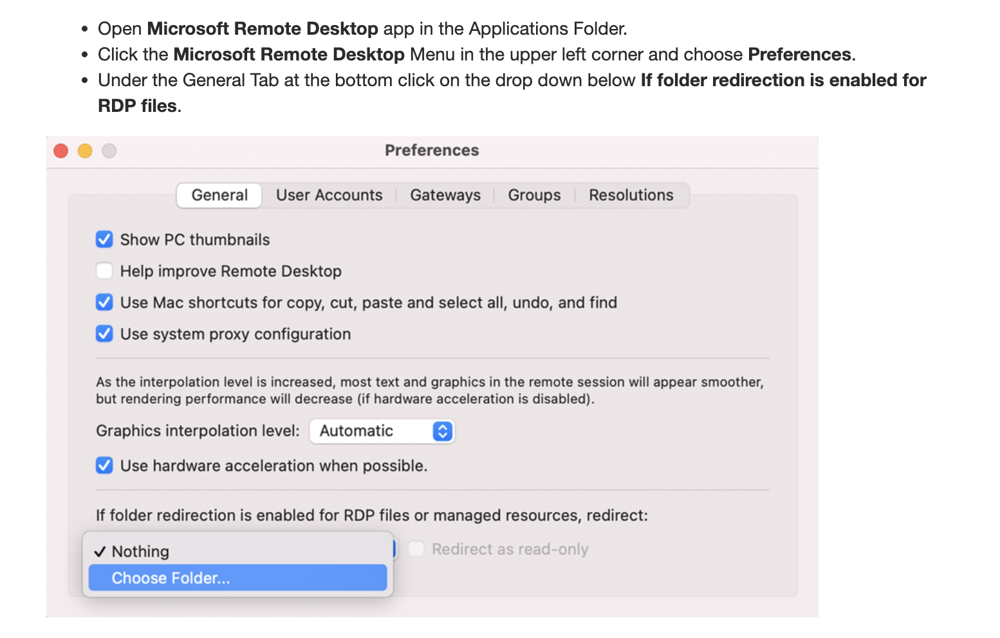
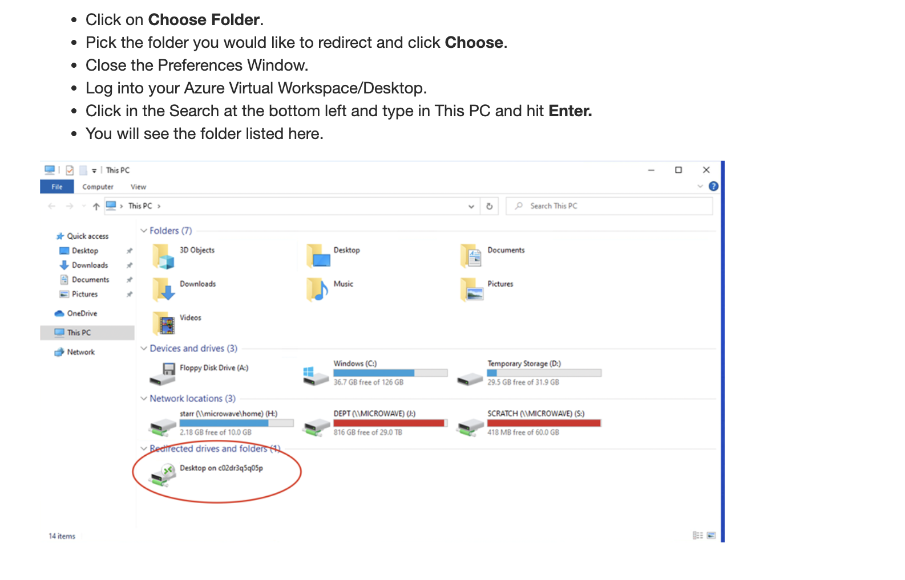
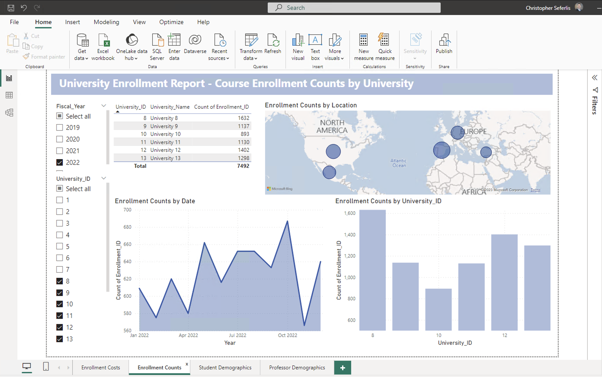
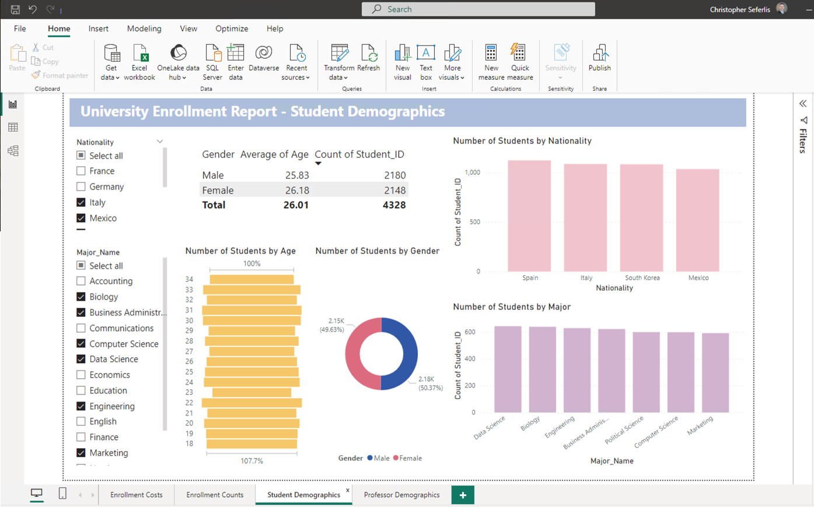
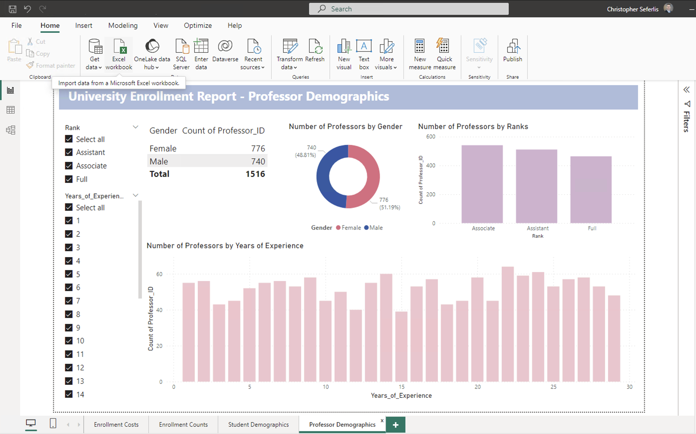
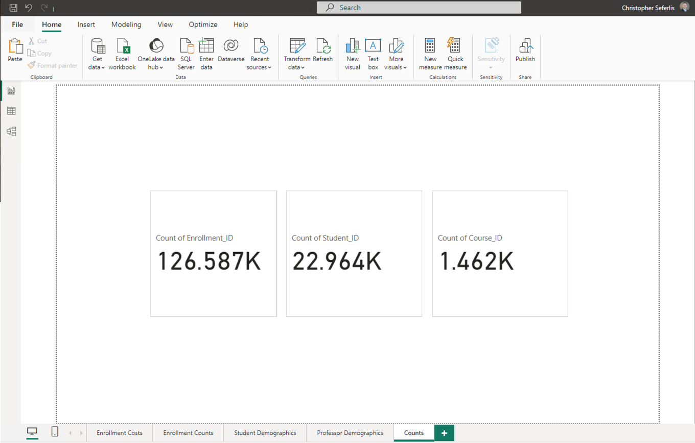
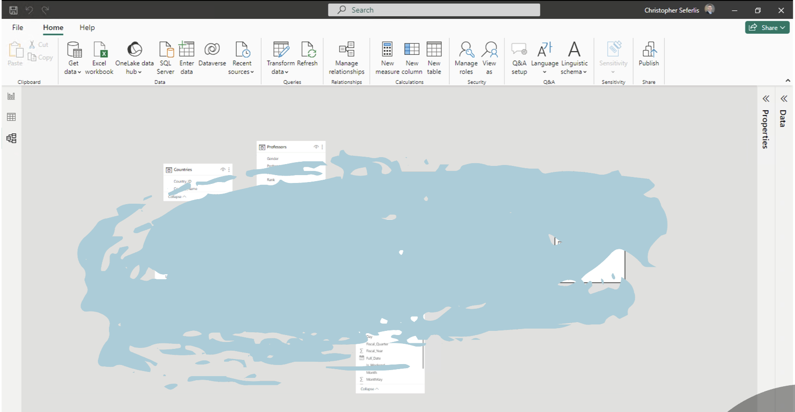
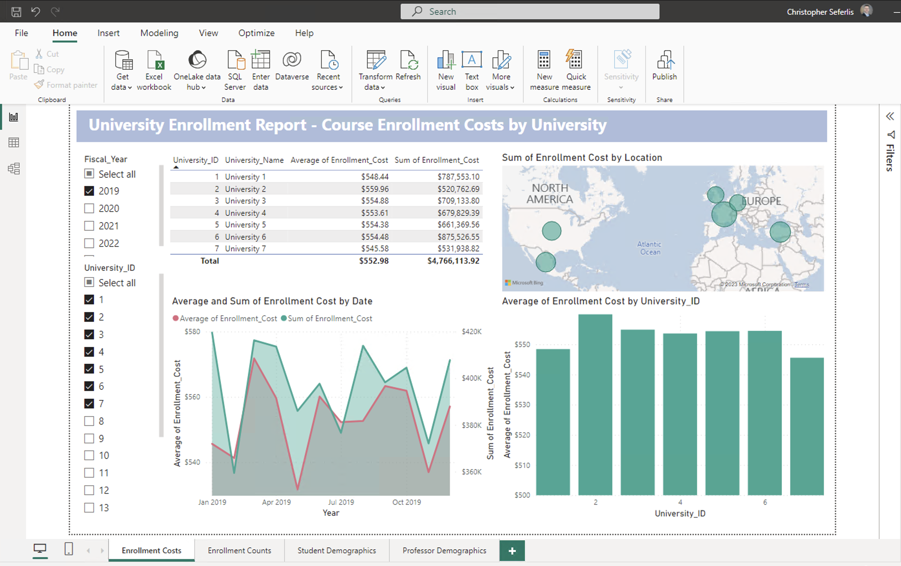

# Homework 8: Microsoft Power BI

## Objective

- The purpose of this homework is to familiarize you with the **Fundamentals of PowerBI.**

- Upon completion, you will have acquired a key skill for data analysts: Data Visualization Tools.

## Tasks

### 1. Execute the Provided Jupyter Notebook to Generate Unique Data.

- Download the hw8.ipynb file from GitHub and execute it using your preferred local IDE or on Google Colab.

### 2. Power BI access for Windows & Mac Users
#### Windows Users
- For **Windows users**, we recommend downloading and using Power BI on your local machine.
#### Mac Users
- **Mac users** should access Power BI by connecting to **Azure Virtual Desktop** using the **Remote Desktop Client**.
  - Refer to this tutorial >> https://learn.microsoft.com/en-us/azure/virtual-desktop/users/connect-macos
 
- Configure **Folder Redirection** for Local Folder Access on Your VM 
  - Refer to this tutorial >> https://bowdoin.teamdynamix.com/TDClient/1814/Portal/KB/ArticleDet?ID=132977
    - 
    - 

### 3. Final Power BI Report Requirements
##### - Refer to this tutorial >> https://learn.microsoft.com/en-us/power-bi/create-reports/desktop-dimensional-model-report
⭐️ **IMPORTANT: SINCE THE DATA IS RANDOMLY GENERATED, THE NUMBERS WILL DIFFER; HENCE, THE EMPHASIS SHOULD BE ON THE VISUAL ASPECTS AND THE COMPONENTS INCLUDED IN THESE VISUALS!!!** ⭐️

- The final report should consist of four interactive pages (The layout should match the provided screenshot.):
    - The first page - **Course Enrollment Costs by University** data.
        - 

    - The second page - **Course Enrollment Counts by University** data
        - 
 
    - The third page - **Student Demographics** data.
        - 

    - The fourth page - **Professor Demographics** data.
        - 

- Add an additional **count** page, that displays the total counts of **'Enrollment_ID,'** **'Student_ID,'** and **'Course_ID.'**
    - 

## Submission
⭐️ **Ensure your BU account information is visible in the top right corner of your screenshot.** ⭐️

Your submission should include the following:

1. **Screenshot of your Snowflake Schema data model.**

2. **Screenshot of all five pages of your final report**

⭐️ **IMPORTANT: SINCE THE DATA IS RANDOMLY GENERATED, THE NUMBERS WILL DIFFER; HENCE, THE EMPHASIS SHOULD BE ON THE VISUAL ASPECTS AND THE COMPONENTS INCLUDED IN THESE VISUALS!!!** ⭐️

